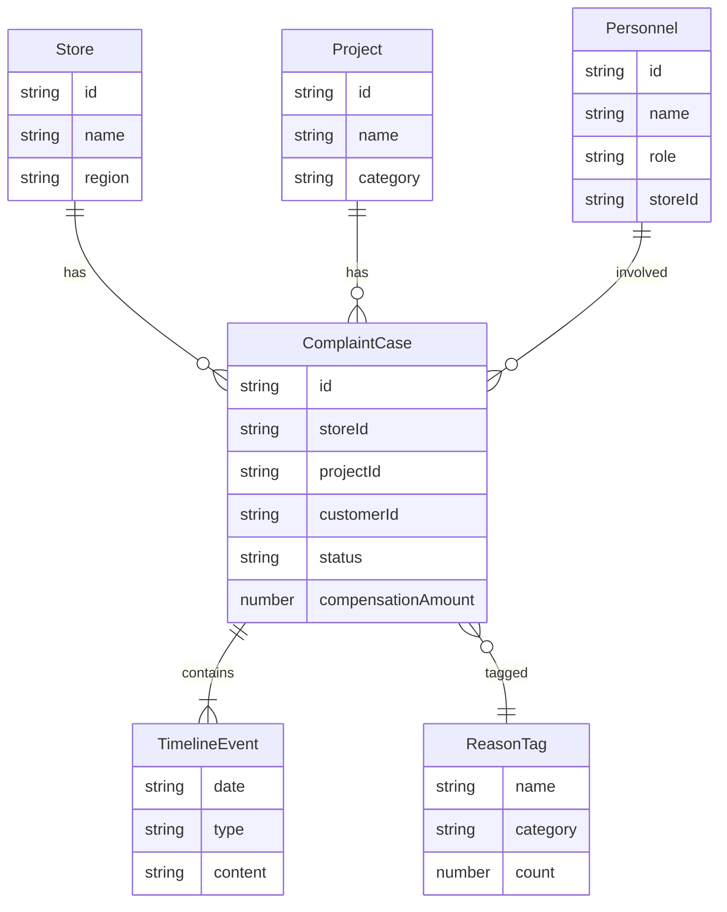

## 1. 架构设计

```mermaid
graph TB
    "前端 React 应用" --> "Zustand 状态管理"
    "Zustand 状态管理" --> "Mock 数据层"
    "前端 React 应用" --> "Recharts 图表库"
    "前端 React 应用" --> "React Router 路由"
    "前端 React 应用" --> "Tailwind CSS 样式"
```

纯前端应用，使用 Mock 数据模拟真实业务场景，不涉及后端服务与数据库。

## 2. 技术说明

- **前端框架**：React 18 + TypeScript
- **构建工具**：Vite
- **样式方案**：Tailwind CSS 3
- **状态管理**：Zustand
- **路由方案**：React Router DOM v6
- **图表库**：Recharts
- **图标库**：Lucide React
- **初始化工具**：vite-init（react-ts 模板）
- **后端**：无（纯前端 + Mock 数据）
- **数据库**：无（使用 TypeScript 数据文件模拟）

## 3. 路由定义

| 路由 | 用途 |
|------|------|
| `/` | 重定向至总览大屏 |
| `/overview` | 总览大屏 - 核心KPI、趋势、排名、预警 |
| `/store-compare` | 门店对比 - 多店横向对比、雷达图 |
| `/project-analysis` | 项目分析 - 投诉率、赔付率、原因标签云 |
| `/personnel` | 人员关联 - 人员统计、热力矩阵、顾客追踪 |
| `/compensation` | 赔付结构 - 赔付方式分布、金额分布、异常预警 |
| `/case-review` | 案例抽检 - 典型案例、协商时间线、原因分类 |

## 4. API 定义

不涉及后端 API，所有数据通过 Mock 数据文件提供。

### 4.1 数据接口类型定义

```typescript
interface Store {
  id: string
  name: string
  region: string
  complaintCount: number
  closedCount: number
  closeRate: number
  avgHandleDays: number
  totalCompensation: number
}

interface Project {
  id: string
  name: string
  category: string
  complaintRate: number
  compensationRate: number
  complaintCount: number
  totalCompensation: number
  reasons: ReasonTag[]
}

interface Personnel {
  id: string
  name: string
  role: 'doctor' | 'consultant' | 'therapist'
  storeId: string
  complaintCount: number
  relatedProjects: string[]
}

interface ComplaintCase {
  id: string
  storeId: string
  projectId: string
  personnelIds: string[]
  customerId: string
  complaintDate: string
  closeDate: string | null
  status: 'open' | 'closed'
  reason: string
  reasonCategory: string
  compensationType: 'refund' | 'rework' | 'repair' | 'gift' | 'cash'
  compensationAmount: number
  timeline: TimelineEvent[]
  isRepeatCustomer: boolean
  isCrossStore: boolean
}

interface TimelineEvent {
  date: string
  type: 'complaint' | 'response' | 'negotiation' | 'resolution'
  content: string
  operator: string
}

interface ReasonTag {
  name: string
  count: number
  category: string
}

interface AlertRule {
  id: string
  type: 'amount_threshold' | 'frequency_spike' | 'repeat_customer'
  threshold: number
  enabled: boolean
}

interface MonthlyReview {
  month: string
  storeId: string
  summary: string
  keyMetrics: Record<string, number>
  issues: string[]
  trainingSuggestions: string[]
  projectAdjustments: string[]
}
```

## 5. 服务端架构

不涉及服务端

## 6. 数据模型

### 6.1 数据模型定义



### 6.2 数据定义

使用 TypeScript 文件定义 Mock 数据，包含：
- 6 个门店数据
- 12 个医美项目数据
- 30+ 个人员数据（医生/咨询师/治疗师）
- 200+ 条客诉案例数据
- 预警规则配置
- 月度复盘摘要数据
